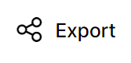

# Icebreaker: Coolors
Generate a color scheme using [coolors](https://coolors.co). Then, share your color scheme with the group!

## Generating Color Schemes
Follow these steps to start generating new color schemes:

1. Go to [coolors.co](https://coolors.co)
1. Click through the opening pop-ups: accept cookies, and close the "What's new" box
1. Click the "Start the generator!" button  
  - 
1. Click the "Let's go!" button
1. Walk through each step of the tutorial
1. Note the important features:  
  - Space bar generates random colors
  - Padlock icon keeps a color when generating
  - X icon removes a color
  - Export button allows for sharing

See what combinations you can create!

## Sharing Color Schemes
Once you have a great palette created, it's time to share it. First, copy a link to your color scheme:

1. Click the "Export" button in the upper right  
  - 
1. Click the "URL" option  
  - 

Next, submit the form to share it:

1. Open the [submission form](https://forms.cloud.microsoft/r/LzSWXbAxCu)  
  - This is also linked from the [camp homepage](BOOKREADME.md)
1. Enter your name and room
1. Paste the link
1. Submit the form

That's it!
